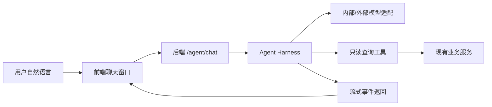

# 智能体目标与范围

## 1. 背景

会议排座助手目前已经实现数字化排座能力：用户可以通过页面人工维护会场布局、人员、座位分配、锁座、占座、版本发布和导出。下一阶段目标是在不破坏现有人工工作流的前提下，引入智能体能力，让用户可以通过自然语言完成查询、辅助操作和自动排座。

公司内部已有智能体平台，提供模型管理、工具管理、技能管理、知识库管理、记忆管理、卡片管理、静态文件管理、原子智能体管理和智能体管理等能力。由于公司开发环境在内网，外部 AI 工具不能带入内网，本项目需要同时支持内部平台和外部公开模型 API，并通过配置切换。

## 2. 总体目标

智能体模块应支持三类能力：

1. 查询任务
   例如“还有哪些人没有排座”“某个人坐在哪里”“第一排还有几个空座”“当前会议是否可以发布”。

2. 前端草稿操作
   例如“把张三移动到 A1”“把技术部人员高亮出来”“把未排人员按部门暂时放到右侧区域”。这类操作只修改当前页面草稿，不直接保存数据库。

3. 复杂排座任务
   例如“按部门集中、领导靠前、同部门尽量相邻、迟到人员靠边排座”。这类任务需要规划、循环调用工具、局部修正和人工确认。

## 3. 当前阶段范围

第一阶段只建设查询闭环。

包含：

- 新增智能体模块设计。
- 定义内部/外部 provider 统一适配方式。
- 定义统一事件协议。
- 定义只读查询工具契约。
- 定义工具调用、结构化输出、重试、超时和终止策略。
- 定义观测和排错记录。

不包含：

- 自动排座算法实现。
- 前端草稿操作工具实现。
- 保存、发布、删除等落库动作交给模型执行。
- 与公司内部 MCP 平台的最终注册细节强绑定。

## 4. 核心原则

### 4.1 不把可靠性交给 prompt

Prompt 可以指导模型，但不能作为唯一安全边界。所有关键动作都必须由代码层校验，包括权限、参数、会议归属、工具风险等级、最大步骤数、最大重试次数和人工确认状态。

### 4.2 模型只提出动作，系统负责执行

模型不能直接修改数据库或前端状态。模型只能发起结构化工具调用请求；工具执行器校验通过后，才可以执行对应动作。

### 4.3 查询先行，操作后置

第一阶段只允许只读查询工具。前端草稿操作在查询闭环稳定后开放。保存、发布、删除等持久化动作默认不开放给模型。

### 4.4 外部模型默认最小数据暴露

外部 DeepSeek、OpenAI-compatible 等公开 API 不能默认接收真实敏感数据。第一阶段外部模式优先用于开发和 mock，可配置脱敏、字段白名单或禁止访问真实会议数据。

### 4.5 内部平台即插即用，不反向污染业务

公司内部 MCP/智能体平台如何注册工具、如何绑定技能、如何调用模型，都应接入本项目的 provider adapter 或 MCP adapter。业务代码不直接依赖某个具体平台形态。

## 5. 分阶段路线

### 阶段一：查询闭环

目标是证明链路可用：

验收示例：

- 用户问“当前还有谁没排座”，系统返回未排人员列表。
- 用户问“张三坐在哪里”，系统返回座位号、区域、是否锁座/占座。
- 用户问“当前会议有多少空座”，系统返回统计摘要。
- 每次运行都有 runId，能查到模型调用、工具调用和错误记录。

### 阶段二：前端草稿操作

模型可以调用草稿工具，但只影响前端 workspace store。

例如：

- `draft.assign_participant_to_seat`
- `draft.unassign_participant`
- `draft.highlight_seats`
- `draft.switch_workbench_mode`

执行后页面展示变化，但数据库不变化。用户仍需点击现有保存按钮。

### 阶段三：复杂排座

复杂排座不采用“模型直接一口气输出最终座位表”的方式，而采用计划与执行结合：

1. 模型理解规则。
2. 系统生成排座计划卡片。
3. 用户确认计划。
4. Harness 按步骤循环调用查询和草稿工具。
5. 每步执行后校验冲突。
6. 最终展示草稿结果，用户人工保存。

### 阶段四：内部平台深度接入

在明确公司内部 MCP 注册方式后，将工具契约映射到公司平台。

此阶段不改变核心原则：平台只是工具与模型入口之一，本项目仍保留自己的适配层、权限层、观测层和回退策略。
