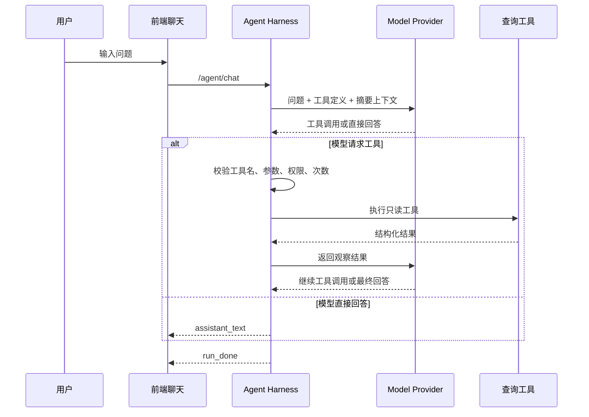

# Agent Harness 运行时设计

## 1. 定义

Agent Harness 是包在模型外侧的一层运行时。它负责把自然语言任务变成受控的执行过程，包括模型调用、工具调用、状态维护、权限检查、结构化校验、重试、超时、流式输出、观测记录和人工确认。

本项目的原则是：不要让模型直接驱动系统状态，而是让 Harness 驾驭模型。

## 2. 运行时职责

Harness 负责：

- 创建 `runId`。
- 加载当前用户、会议和配置。
- 选择 provider。
- 组装可用工具列表。
- 控制模型调用与工具调用循环。
- 校验工具参数和工具权限。
- 执行工具并整理观察结果。
- 控制最大步数、最大重试次数和最大运行时长。
- 将 provider 原始输出归一化为 Agent Event。
- 记录审计日志和错误。
- 在需要人工确认时暂停。

Harness 不负责：

- 直接保存排座结果。
- 绕过现有后端 Service 校验。
- 将数据库对象原样暴露给模型。
- 替代现有页面的人工保存、发布、导出流程。

## 3. 第一阶段查询循环

查询阶段可以使用轻量 ReAct 风格循环：

查询任务一般不需要复杂计划，只要限制循环即可。

## 4. 后续复杂任务范式

复杂排座不建议只用无限 ReAct 循环。推荐混合模式：

1. Plan
   模型先输出计划，包括排序依据、约束解释、预计工具步骤。

2. Human Review
   前端展示计划卡片，用户确认、修改或取消。

3. Execute
   Harness 按计划循环执行原子工具。

4. Validate
   每一步或每批操作后，系统校验冲突、重复排座、锁座、占座、权限和草稿版本。

5. Summarize
   完成后输出本次草稿变更摘要。

## 5. 终止条件

每次运行必须有硬终止条件。

建议默认值：

| 条件 | 建议值 | 触发后行为 |
| --- | --- | --- |
| 最大工具步数 | 查询 8，草稿 20，复杂排座单批 50 | 停止运行，说明已完成步骤和未完成原因 |
| 单步模型修复重试 | 1 次 | 仍失败则停止 |
| 单个工具重试 | 1 次 | 仍失败则返回工具错误 |
| 参数修复次数 | 2 次 | 仍失败则请用户澄清 |
| 最大运行时长 | 查询 60 秒，复杂任务按后续设计扩展 | 超时停止 |
| 空转次数 | 2 次 | 模型连续无有效动作则停止 |

## 6. 重试策略

重试分四类：

### 6.1 模型网络重试

适用于 provider 网络抖动、连接超时、限流等临时问题。

- 最多 1 到 2 次。
- 使用短退避。
- 重试仍失败时返回“智能体服务暂时不可用”。

### 6.2 结构化输出修复

适用于模型输出不符合 schema。

- Harness 将校验错误作为观察结果反馈给模型。
- 最多修复 1 次。
- 修复失败则停止，不执行任何工具。

### 6.3 工具参数修复

适用于工具名存在，但参数缺失、类型错误、枚举错误或引用不存在。

- 工具执行器返回结构化 `tool_error`。
- 模型最多修复 2 次。
- 仍失败则向用户说明需要补充的信息。

### 6.4 工具执行重试

适用于只读查询工具的临时失败。

- 查询工具可以重试 1 次。
- 草稿工具只有在幂等且携带 `operationId` 时才允许重试。
- 落库工具第一阶段不存在；未来即使开放，也不允许模型自动重试保存、发布、删除。

## 7. 流式输出

前端应接收服务端统一 SSE，而不是 provider 原始 SSE。

原因：

- 内部平台和外部模型流式格式不同。
- 工具调用事件需要被前端稳定渲染。
- 错误、重试、guardrail 拦截需要结构化展示。

第一阶段前端至少支持：

- 文本流式追加。
- 工具轨迹折叠展示。
- 运行中 loading。
- 错误提示。
- 结束状态。

## 8. 幂等与部分失败

查询阶段没有状态修改，幂等风险较低。

未来草稿操作阶段，每个前端命令或草稿工具调用都必须有：

- `operationId`
- `meetingId`
- `workspaceRevision`
- `participantId`
- `targetElementId`
- `expectedPreviousState` 可选

执行前先校验当前草稿状态。批量操作应尽量先做整体预校验，再一次性应用；如果必须分步执行，需要生成可展示的部分成功/失败摘要。
