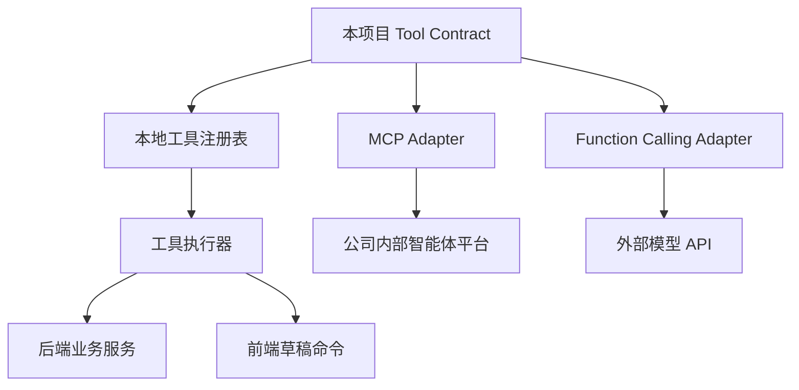

# 工具注册与 MCP 适配契约

## 1. 设计立场

MCP 可以理解为一种把工具、资源和上下文暴露给模型/智能体平台的协议形态。公司内部平台是否直接注册 MCP、是否通过页面配置接口路径、是否由平台自动转换成 Function Calling，最终都不应改变本项目的内部设计。

本项目先建立自己的工具契约和工具执行层，再提供 MCP adapter 或内部平台 adapter。这样可以做到：

- 工具定义统一。
- 权限和风险等级统一。
- 内外环境可切换。
- 后续公司平台变化时只替换适配层。

## 2. 工具设计原则

### 2.1 原子化

工具只做一件明确的事，不做大而全封装。

推荐：

- `participant.search`
- `participant.get_detail`
- `seat.search`
- `seat.get_occupant`
- `assignment.list_unassigned`
- `assignment.get_summary`

不推荐：

- `do_everything_for_seating`
- `auto_handle_user_request`
- `query_workspace_and_arrange_seats`

### 2.2 明确副作用

每个工具必须声明副作用等级：

| 等级 | 含义 | 第一阶段是否允许 |
| --- | --- | --- |
| `read` | 只读查询，不改变状态 | 允许 |
| `draft` | 只改前端草稿，不落库 | 暂不允许 |
| `commit` | 修改后端持久化数据 | 不允许 |
| `external` | 调用外部系统或发送消息 | 不允许 |

### 2.3 输入输出结构化

每个工具必须有：

- `name`
- `description`
- `inputSchema`
- `outputSchema`
- `sideEffect`
- `riskLevel`
- `requiresConfirmation`
- `idempotent`
- `resultPolicy`

示例：

```json
{
  "name": "assignment.list_unassigned",
  "description": "查询当前会议中尚未安排座位的参会人员，支持按姓名、部门、状态等条件过滤。只返回摘要列表，不返回完整敏感字段。",
  "sideEffect": "read",
  "riskLevel": "low",
  "requiresConfirmation": false,
  "idempotent": true,
  "inputSchema": {
    "type": "object",
    "properties": {
      "meetingId": { "type": "integer" },
      "keyword": { "type": "string" },
      "limit": { "type": "integer", "minimum": 1, "maximum": 100 }
    },
    "required": ["meetingId"]
  },
  "outputSchema": {
    "type": "object",
    "properties": {
      "total": { "type": "integer" },
      "items": {
        "type": "array",
        "items": {
          "type": "object",
          "properties": {
            "participantId": { "type": "integer" },
            "name": { "type": "string" },
            "employeeNo": { "type": "string" },
            "status": { "type": "string" }
          }
        }
      }
    }
  },
  "resultPolicy": {
    "maxItems": 100,
    "summaryRequired": true,
    "sensitiveFields": []
  }
}
```

## 3. 第一阶段查询工具候选

第一批工具只读、低风险、可审计。

| 工具名 | 用途 |
| --- | --- |
| `workspace.get_summary` | 获取当前会议工作区摘要：人数、座位数、已排/未排/锁座/占座统计 |
| `participant.search` | 按姓名、工号、动态字段等搜索参会人员 |
| `participant.get_detail` | 查询单个参会人员详情，返回字段按白名单控制 |
| `assignment.list_unassigned` | 查询未排人员 |
| `assignment.list_assigned` | 查询已排人员 |
| `seat.search` | 按座位号、区域、状态查询座位 |
| `seat.get_occupant` | 查询某个座位当前坐了谁 |
| `region.list` | 查询当前会议区域/标记信息 |
| `version.list` | 查询当前会议发布版本 |
| `publish.check_readiness` | 查询当前会议发布前检查摘要，不执行发布 |

## 4. 后续草稿工具候选

草稿工具只改变前端页面状态，不保存数据库。

| 工具名 | 用途 |
| --- | --- |
| `draft.switch_mode` | 切换工作台模式 |
| `draft.highlight_participants` | 高亮人员 |
| `draft.highlight_seats` | 高亮座位 |
| `draft.assign_participant_to_seat` | 将人员放到指定座位草稿 |
| `draft.unassign_participant` | 将人员从座位移回待排列表草稿 |
| `draft.batch_assign` | 批量草稿排座，必须先预校验 |
| `draft.clear_highlight` | 清除高亮 |

## 5. MCP 适配方式

建议把 MCP 视为外部暴露形态，而不是本项目内部唯一实现。



适配层职责：

- 将本项目工具契约转换成 MCP tool 或 function calling 格式。
- 将平台传入参数转换成本项目内部参数。
- 将工具结果转换成平台需要的响应格式。
- 保留本项目的权限、风险等级和审计记录。

## 6. 工具描述规范

工具 description 会影响模型是否正确选工具。每个 description 必须包含：

- 工具能做什么。
- 工具不能做什么。
- 何时应该调用。
- 关键参数含义。
- 返回结果限制。

示例：

```text
查询当前会议中尚未安排座位的参会人员。该工具只读，不会改变排座结果。
当用户询问“谁还没排座”“未安排人员”“待排人员”时使用。
如果用户提供姓名、部门或其他关键词，可通过 keyword 过滤。
默认只返回摘要列表；需要完整详情时再调用 participant.get_detail。
```

## 7. 工具结果控制

工具结果不能无限返回。

要求：

- 默认分页或限制 `limit`。
- 大列表返回摘要和 cursor。
- 敏感字段按白名单输出。
- 工具结果进入模型上下文前可再压缩。
- 前端展示可以比模型上下文保留更多明细，但要分开存储。

## 8. 工具变更管理

每次新增或修改工具都需要更新：

- 工具契约文档。
- 工具 schema。
- 单元测试或契约测试。
- 评测用例。
- 风险等级说明。

如果工具副作用从 `read` 升级为 `draft` 或 `commit`，必须新增 ADR 或更新 guardrail 文档。
