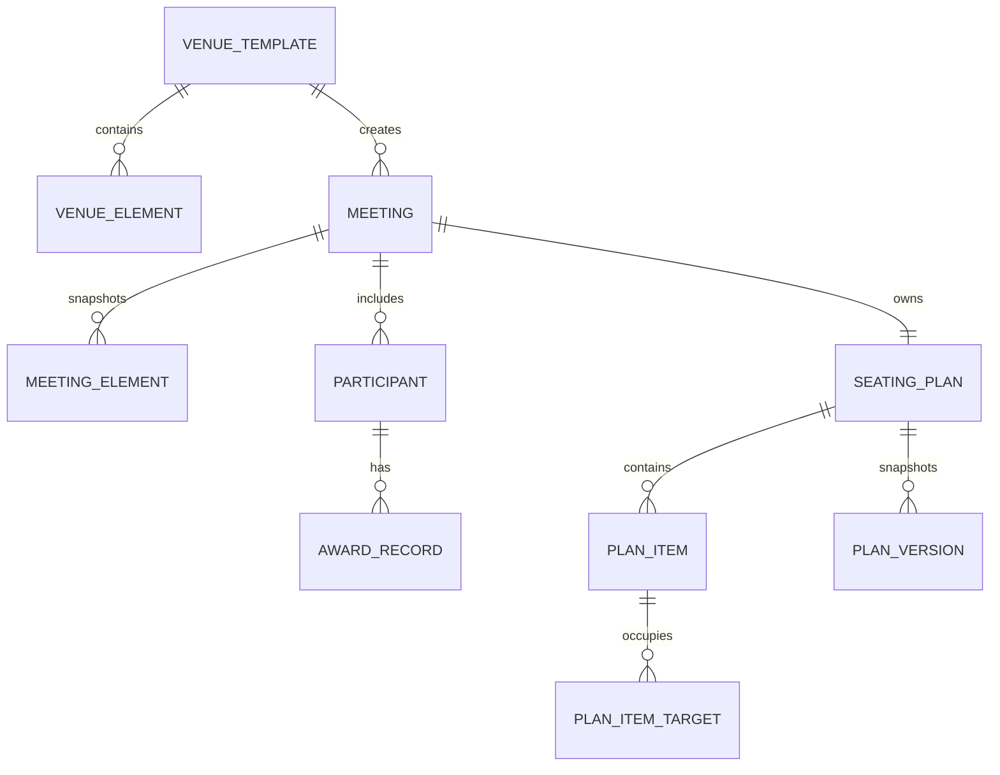

# 系统架构

## 设计边界

系统核心面向“会议人工排座”，颁奖只是首个场景。场馆空间、参会人员、排座方案与场景业务数据彼此解耦：

- **场馆模板**保存可复用的二维布局；会议创建时复制成布局快照，后续修改模板不会影响历史会议。
- **布局元素**统一表达座位、舞台、走廊、墙、门、楼梯、桌子和标签等对象，并用行、列、跨行、跨列描述占用范围。
- **参会人员**只保存通用身份字段和可扩展属性；奖项、批次等数据由场景记录承载。
- **排座方案**保存当前可编辑状态；**方案版本**保存不可变快照，可从版本历史恢复为新的当前状态，用于回退和防误操作。
- **临时占用**属于排座方案而非场馆模板，既能表示一个人占一个座位，也能表示摄像机等设备占多个布局元素。

## 导入扩展方式

导入采用“固定流程 + 场景策略 + 字段元数据”：

1. 固定流程负责文件校验、模板识别、重复工号分组、预览和提交。
2. `WorkbookImportStrategy` 负责声明一个场景包含哪些工作表以及如何解析业务记录。
3. 通用人员列写入固定字段，额外列写入人员扩展属性；前端根据返回的字段定义自动生成筛选条件。
4. 新场景通过新增策略注册，不需要修改既有通用会议或颁奖会议解析代码。

当前提供：

- `GENERAL_MEETING_V1`：一个“参会人员”工作表。
- `AWARD_CEREMONY_V1`：“参会人员”与“获奖记录”两个工作表；同一工号的多条获奖记录是正常业务数据。

## 前后端职责

- Vue 工作台负责布局渲染、拖拽交互、筛选视图和当前浏览器会话的撤销/重做。
- Spring Boot 负责所有权威状态、座位容量及交换校验、导入预检、版本快照保存/恢复和文件导出。
- PostgreSQL 保存正式运行数据，Flyway 管理关系模型；人员扩展属性、布局样式和版本快照使用 JSON 文本保存，以兼顾结构稳定性和场景扩展性。
- 内存 H2 仅用于自动化测试，不再作为开发或生产运行数据库。

## 用户隔离接入边界

当前演示版在前端通过独立的会话模块提供当前用户和租户信息，首页只展示“我的会议”入口；它是后续公司统一认证 SDK 的替换点，不把演示用户写散在业务组件中。

正式接入认证时，后端需要从可信令牌或网关上下文解析 `tenantId`、`userId`，并将租户和创建人条件纳入会议、场馆、排座方案及版本的所有查询和写入校验。前端传来的用户标识只能用于展示，不能作为数据权限依据。数据库实体目前已有创建/更新审计字段，租户列和数据权限拦截器在认证 SDK 确定后补齐。

## 第一版明确不做

- 按规则一键排座。
- 上台路径与舞台站位动态计算。
- 圆桌自动生成和环形编号。
- 公司外部人员。
- 多人实时协同和统一认证接入。

这些能力均保留扩展边界，不影响当前人工排座闭环。
