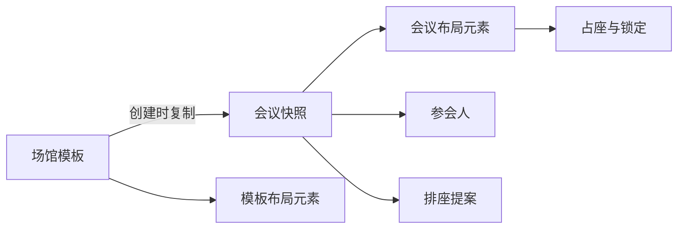

# 会议排座助手架构说明

本文描述当前实现采用的架构与约束。系统是前后端分离的单体应用：前端负责交互与即时反馈，后端负责权限、业务规则、事务和持久化。

## 核心领域

系统围绕两类资源展开：

- 场馆模板：所有用户共享的全局资源，包含基础信息和可复用的二维布局。
- 会议：属于当前用户的业务实例，创建时复制场馆信息与布局快照。

模板只负责提供创建时的起点。会议创建完成后不依赖模板继续存在，因此编辑或删除模板不会改变已有会议。

上图表示业务上的逻辑关系，不代表数据库外键。

## 技术栈

### 前端

- Vue 3、Vue Router
- JavaScript
- Element Plus 2.8
- Vite

### 后端

- Java 21
- Spring Boot
- MyBatis-Plus
- PostgreSQL

后端按 API、Service、Mapper、领域模型分层。Controller 只处理协议转换与参数校验；Service 承担权限、规则和事务；Mapper 执行 PostgreSQL 持久化。

## PostgreSQL 持久化约束

- `DDL/meeting_helper.sql` 是正式 schema 的唯一建表入口。
- DDL 不包含种子数据、外键、软删除列或启动迁移逻辑。
- 应用不在启动时写入场馆或演示数据。
- 删除采用物理删除，关联记录由应用事务按明确顺序清理。
- 并发更新使用版本字段；需要串行化业务判断时使用 PostgreSQL 行锁。
- 测试也运行在专用 PostgreSQL 数据库中，确保 SQL 与正式环境一致。

由于数据库不声明外键，Service 必须在同一事务中完成存在性校验、关联清理和主体写入，并将冲突转换为统一业务错误。

## 场馆模板

场馆模板由基础信息和布局元素组成。

### 基础信息

- 地点使用去除首尾空白、忽略大小写的精确唯一性判断。
- 可选文本在写入前去除首尾空白，空字符串保存为 `NULL`。
- 预定链接只接受绝对 `http` 或 `https` URL。
- 人工容纳人数是业务参考值，与布局中的座位数可以不同；编辑器仅给出不一致提示。

### 布局编辑器

- 新建模板使用默认 `20 × 30` 网格，画布可通过边缘和角点扩展。
- 元素分为座位与通用元素；座位允许占用多个网格单元。
- 支持点击选择、框选、拖动、八方向缩放、属性编辑、复制删除、撤销与重做。
- 支持右键平移和滚轮缩放；当前版本不支持元素旋转。
- 元素选择器和画布操作分别维护临时冲突状态，取消选择器不会污染画布缩放冲突提示。
- 前端冲突提示用于即时反馈，后端保存时仍执行最终合法性校验。

## 会议快照

创建会议时，后端在事务中复制模板的展示信息和全部布局元素，生成会议自己的版本。复制完成后：

- 会议读取自己的快照，不回查模板布局。
- 模板修改不会回写会议。
- 模板删除不会级联删除会议。
- 后续座位分配、占座、锁定和提案只作用于会议布局元素。

## 用户隔离

- 场馆模板对所有用户可见、可复用。
- 会议列表、会议详情、参会人和工作台操作都必须按当前用户校验。
- 后端权限校验是隔离边界，前端路由与按钮状态只用于交互引导。

## 导出

- Excel 排座图按座位块导出，支持动态字段竖向展开、同值合并、左右排号和空白画布区域无边框。

## API 与错误处理

- 业务接口使用 GET 或 POST。
- Controller 返回统一响应结构。
- 参数格式错误、资源不存在、权限不足、唯一性冲突和并发冲突由后端映射为稳定的业务错误。
- 前端可做提前校验，但不能替代后端校验。

## 测试策略

- 后端集成测试连接专用 PostgreSQL 数据库，并在测试上下文启动时重建测试 schema。
- 前端使用 Node 测试覆盖模型函数、组件契约和关键运行时交互。
- 构建验证使用 Vite 正式构建，防止仅测试环境可用的代码进入交付。

## 当前边界

- 单实例部署，不包含跨服务事务。
- 不包含数据库外键、软删除和自动种子数据。
- 不包含元素旋转。
- 会议创建后不与场馆模板保持实时同步。
