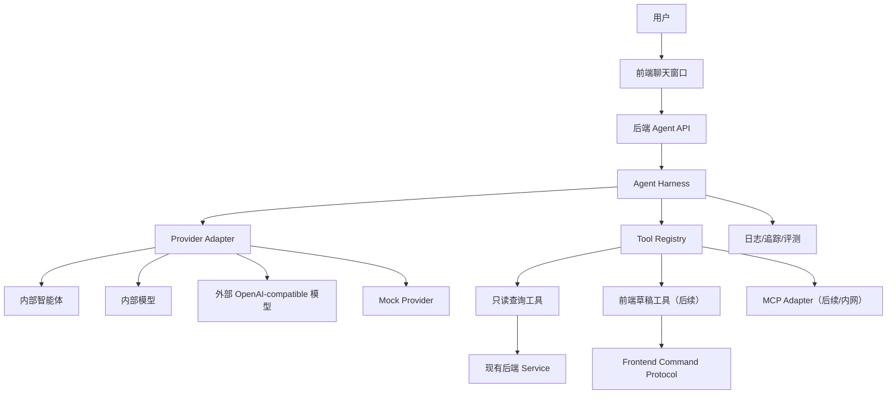

# 智能体驾驭层设计规格

## 1. 目标

在会议排座助手中新增智能体能力，使用户可以通过自然语言完成查询、辅助操作和复杂排座。设计必须兼容公司内网智能体平台和外部开发环境，不破坏现有人工排座工作流。

本规格聚焦第一阶段：查询闭环与智能体驾驭层基础设计。

## 2. 范围

包含：

- Agent Harness 总体架构。
- 内部/外部模型 provider adapter。
- 统一 Agent Event。
- 只读查询工具契约。
- MCP 作为可插拔工具适配层。
- Guardrails、重试、超时、终止条件。
- 上下文与记忆策略。
- 观测、审计和排错文档体系。

不包含：

- 自动排座实现。
- 前端草稿命令实现。
- 保存/发布/删除等持久化动作交给模型执行。
- 公司内部 MCP 平台最终配置细节。

## 3. 架构

## 4. 核心设计决策

1. 查询先行，不开放模型直接写数据库。
2. 前端和业务代码只依赖本项目统一 Agent API，不依赖具体模型平台。
3. MCP 作为工具暴露适配层，不作为内部业务边界。
4. 工具必须原子化、结构化、有风险等级。
5. 结构化输出必须校验，校验失败最多有限修复。
6. 长任务状态由 Harness 维护，不能依赖模型记忆。
7. 外部模型默认最小数据暴露。
8. 所有运行必须有 runId，可审计、可回放、可排错。

## 5. 第一阶段验收

第一阶段完成后，应支持：

- 用户询问未排人员，智能体通过工具查询并返回。
- 用户询问某人坐在哪，智能体通过工具查询并返回。
- 用户询问座位占用、空座统计、发布前检查，智能体能选择正确查询工具。
- 当用户要求保存、发布或删除时，系统拦截并说明当前不支持。
- provider 可通过配置在 mock、内部、外部之间切换。
- 每次运行记录 runId、provider、模型、工具调用和结果摘要。

## 6. 文档落点

详细设计拆分维护在 `docs/agent/`：

- `README.md`
- `00-agent-vision-and-scope.md`
- `01-provider-adapter-contract.md`
- `02-agent-harness-runtime.md`
- `03-tool-registry-and-mcp-contract.md`
- `04-guardrails-and-permission-policy.md`
- `05-context-and-memory-strategy.md`
- `06-observability-and-incident-playbook.md`
- `07-framework-and-harness-position.md`
- `adr/`

## 7. 后续计划入口

用户确认本规格与 `docs/agent/` 文档后，再进入实现计划阶段。实现计划应优先覆盖：

1. 后端 agent 配置和 mock provider。
2. `/agent/chat` 查询接口和 SSE 事件。
3. 第一批只读工具。
4. 前端聊天窗口。
5. 观测日志和基础评测用例。
