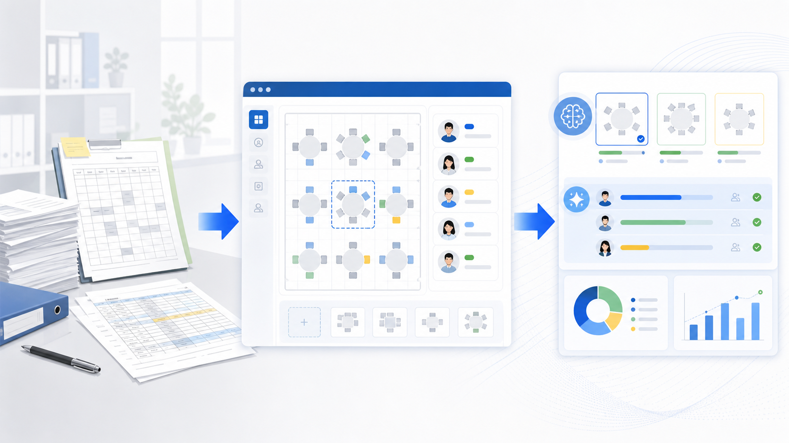
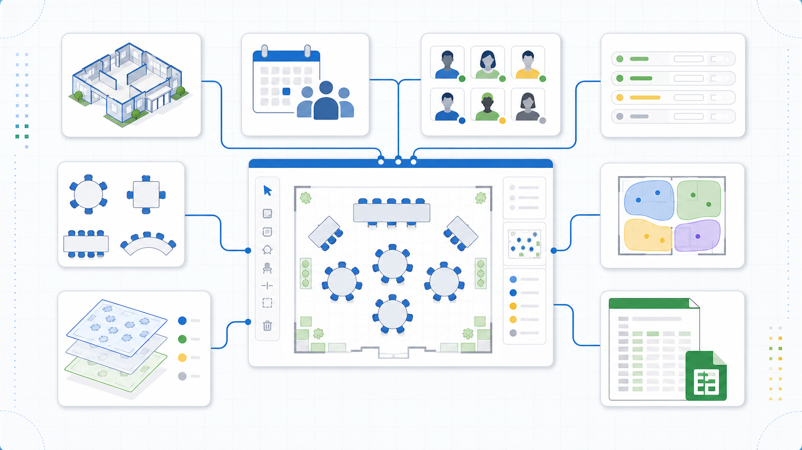
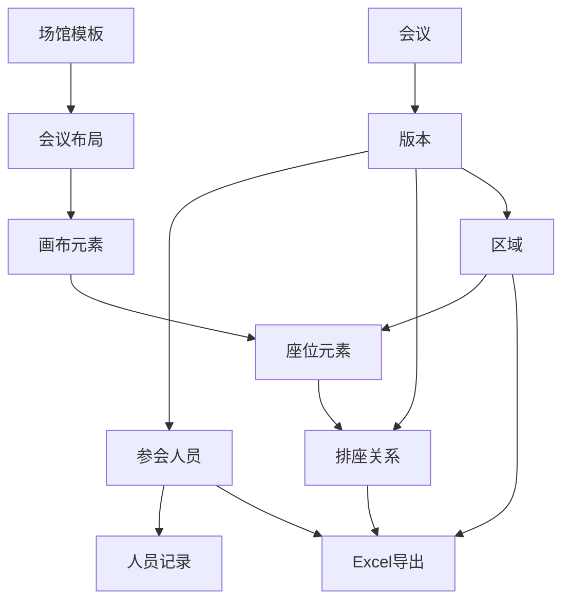
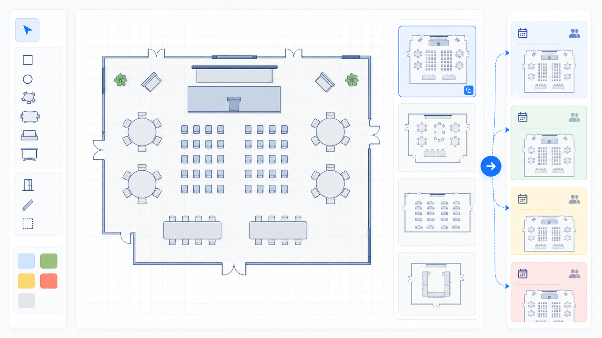
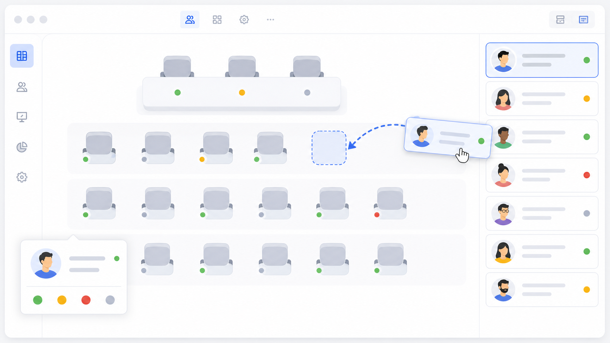
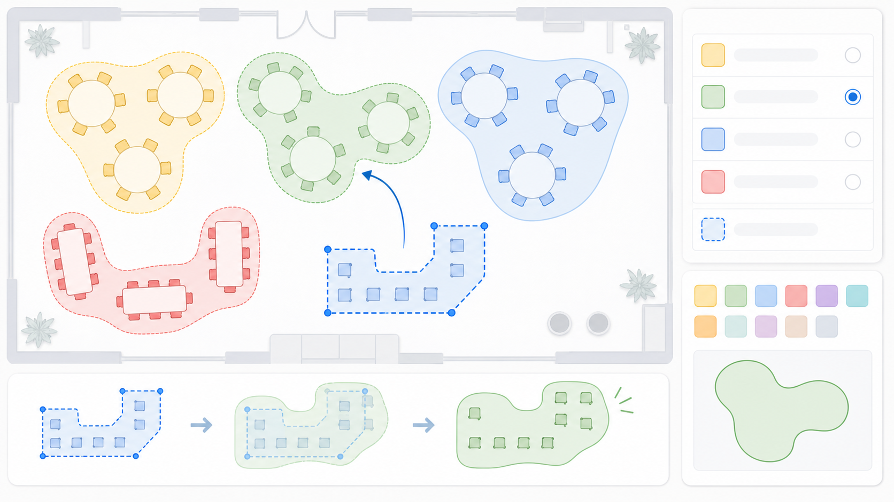
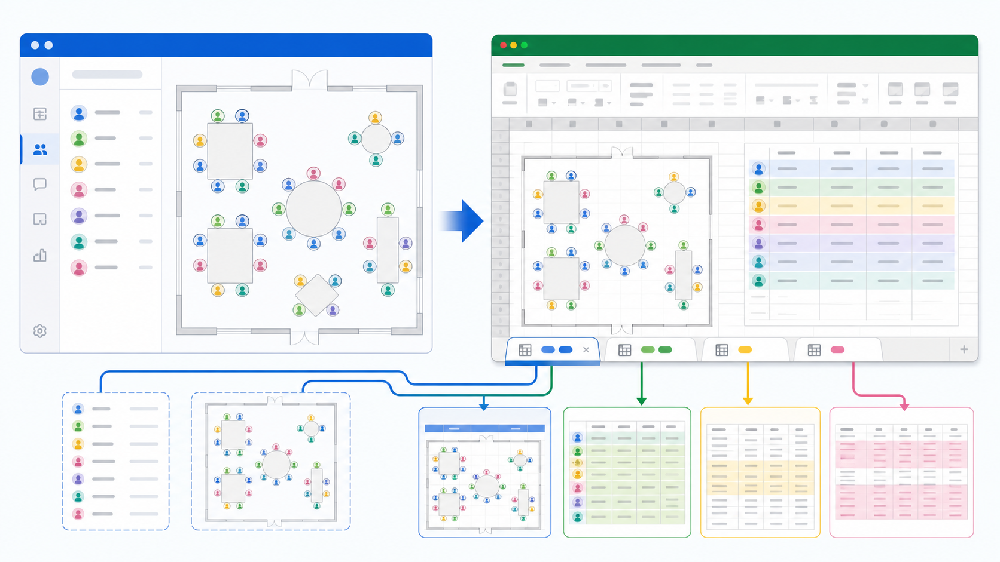

# 从传统作业到数字化再到智能化的实战分享

## 文档定位

这份文档介绍会议排座助手平台的建设思路。它不是一份单纯的功能说明书，也不是一份代码设计文档，而是从业务场景出发，解释我们为什么要做这个系统、系统解决了什么问题、每个关键功能背后的设计取舍是什么，以及它如何从传统人工作业走向数字化，再进一步走向智能化。

读者不需要提前了解平台。可以把它想象成一个专门解决会议排座、场馆布局、人员信息管理和排座结果交付的工具。过去这些工作通常由工作人员拿着 Excel、截图、场地图、微信群消息反复确认完成；平台的目标是把这些散落的动作变成可复用、可追踪、可校验、可导出的数字化流程。

本文会围绕七个问题展开：

| 章节 | 核心问题 | 读完应理解的内容 |
| --- | --- | --- |
| 第一章 | 为什么会议排座值得数字化 | 会议排座不是简单拖座位，而是信息流、规则流和交付流的综合问题 |
| 第二章 | 系统如何抽象业务对象 | 为什么要有会议、版本、场馆模板、座位、人员、动态字段、区域等对象 |
| 第三章 | 场馆模板解决什么问题 | 如何把一次性画图变成可复用的场馆资产 |
| 第四章 | 排座工作台如何形成闭环 | 人员导入、单个新增、分组着色、拖拽排座、草稿发布如何协同 |
| 第五章 | 为什么需要区域能力 | 不是所有会议都要精确到人，区域能表达“这片座位给某类人” |
| 第六章 | 为什么导出 Excel 很关键 | 数字化系统最终仍要服务线下执行和外部系统对接 |
| 第七章 | 智能化可以怎样演进 | 当规则和数据沉淀下来，系统可以从记录工具变成辅助决策工具 |

---

## 第一章 背景：会议排座不是“小工具”，而是复杂协同问题



### 1.1 传统排座作业的真实链路

会议排座看起来只是把人放到座位上，但真实工作往往比这个复杂。以一次颁奖会议或大型内部会议为例，工作人员通常要完成下面这些动作：

1. 收集参会人员名单，包括工号、姓名、部门、批次、角色、是否出席等信息。
2. 找到合适的场馆，确认这个场馆有多少座位、入口在哪里、舞台在哪里、摄像机或显示屏在哪里。
3. 根据会议规则安排座位，例如领导靠前、嘉宾集中、同部门尽量连坐、不同批次需要区分颜色。
4. 不断接收变更，例如某个人临时不来、某个部门新增人员、场馆布局临时调整。
5. 把最终排座结果交付给现场工作人员、主持人、礼仪人员或其他系统。

如果用传统方式完成，这些信息会分散在多个地方：

| 信息类型 | 传统载体 | 常见问题 |
| --- | --- | --- |
| 人员名单 | Excel、邮件附件、聊天文件 | 多个版本并存，字段不统一，重复人员难处理 |
| 场馆布局 | 图片、PPT、临时 Excel 网格 | 复用困难，改一次就要重新画 |
| 排座结果 | Excel 标色、截图、口头确认 | 排座依据不透明，修改后容易漏同步 |
| 现场交付 | 打印文件、微信群截图 | 现场人员只能看结果，难追溯来源 |
| 对接数据 | 人工整理字段 | 字段命名、编码、座位编号容易出错 |

这类工作最麻烦的地方不在“画座位”，而在“变更之后还能不能保持一致”。比如用户把张三从第 2 排第 4 个座位挪到第 3 排第 1 个座位，系统需要同步影响：

1. 画布上的座位展示。
2. 人员列表里的状态。
3. 导出的人员名单。
4. 导出的排座图。
5. 座位明细。
6. Lookup 类数据。

只靠手工处理时，这些同步动作很难不出错。

### 1.2 数字化不是把 Excel 搬到网页上

很多系统建设的第一步会犯一个错误：把线下 Excel 原样搬到网页上。表面上看，这样实现快，用户也熟悉。但它只解决了“在线填写”的问题，没有解决“业务结构化”的问题。

真正的数字化至少要做到三点：

| 层次 | 说明 | 平台中的体现 |
| --- | --- | --- |
| 数据结构化 | 业务对象被系统识别，而不是一堆单元格 | 人员、座位、区域、模板、版本都有独立含义 |
| 操作可追踪 | 用户做过什么修改，系统知道并能保存 | 草稿版本、保存状态、发布版本、撤销重做 |
| 结果可复用 | 本次经验能服务下次会议 | 场馆模板、常用颜色、动态字段、导出配置 |

举个例子，如果 Excel 里写着“第二排第四个座位坐张三”，对 Excel 来说这只是一段文本；但在平台里，这句话会被拆成几个明确对象：

| 对象 | 示例 | 系统可以做什么 |
| --- | --- | --- |
| 人员 | 张三，工号 a12345678 | 校验唯一性、展示扩展字段、导出人员信息 |
| 座位 | 第 2 排第 4 个 | 生成座位编号、计算座位总数、支持拖拽换座 |
| 关系 | 张三坐在第 2 排第 4 个 | 保存排座结果、清空已排人员、导出座位明细 |
| 规则 | 按获奖批次着色 | 同批次同颜色，导出时保持一致 |

数字化的核心就是：让系统真正理解业务含义，而不是只记录用户画出来的结果。

### 1.3 从传统到数字化再到智能化的路径

平台演进可以分成三个阶段：


第一阶段是传统作业，特点是灵活但依赖人。工作人员可以临时改、临时画、临时解释，但经验都留在个人脑子里。

第二阶段是数字化，特点是把规则和结果沉淀到系统。谁坐哪里、为什么这样分组、哪些座位属于某个区域，都能被系统记录。

第三阶段是智能化，特点是系统开始参与决策。它不只是保存用户的动作，还能根据历史数据、会议规则、人员属性给出建议。例如发现某个部门人数较多，可以建议连续区域；发现排座人数超过场馆容量，可以提前拦截；发现某个批次颜色和场馆元素颜色冲突，可以提示用户换色。

平台当前的重点是把第二阶段做扎实，同时为第三阶段准备数据基础。

---

## 第二章 业务建模：先把隐性规则变成显性对象



### 2.1 为什么要先建模

如果没有业务建模，系统会很快变成一堆零散功能：导入 Excel 是一个功能，画座位是一个功能，导出 Excel 又是一个功能。每个功能单独看都能运行，但串起来以后会出现大量问题：

1. 导入时有动态字段，排座时不知道怎么展示。
2. 模板里叫“座位”，进入会议后不知道应该显示“第几排第几个”。
3. 区域里标记了“嘉宾”，导出时座位明细没有区域名称。
4. 用户修改了布局，切换模式时系统不知道是否需要提示保存。
5. 同一个工号有多条业务记录，系统不知道是重复人员还是同一人的多条扩展信息。

这些问题不是某个按钮写错了，而是业务对象没有被明确拆开。平台的设计思路是先定义核心对象，再让功能围绕对象运转。

### 2.2 平台核心对象

平台中最重要的对象如下：

| 对象 | 含义 | 典型字段或能力 |
| --- | --- | --- |
| 场馆模板 | 可复用的场馆布局资产 | 地点、园区、容纳人数、接口人、备注、画布元素 |
| 会议 | 一次具体排座任务 | 会议名称、选用模板、版本、人员名单、排座结果 |
| 版本 | 会议在某个阶段的状态 | 草稿版本、已发布版本、保存状态、发布时间 |
| 画布 | 承载场馆布局和座位的位置空间 | 行列尺寸、缩放、拖动、框选、元素坐标 |
| 元素 | 画布上的对象 | 座位、门、墙、桌子、摄像、舞台、显示屏、自定义元素 |
| 座位 | 可安排人员的特殊元素 | 第几排、第几个、是否已排人、所属区域 |
| 人员 | 参会人员主体 | 工号、姓名、状态、座位、扩展字段 |
| 人员记录 | 同一人员的多条业务信息 | 部门、获奖批次、其他动态字段 |
| 区域 | 一组座位的业务标记 | 区域名称、颜色、包含座位集合 |
| 导出任务 | 将系统结果转成 Excel | 人员名单、排座图、座位明细、Lookup 数据 |

这里需要重点解释“人员”和“人员记录”的区别。

在平台里，一个工号对应一个真实的人，因此同一个工号不能对应多个姓名。但一个人可能有多条业务记录。例如：

| 工号 | 姓名 | 部门 | 获奖批次 |
| --- | --- | --- | --- |
| A001 | 张三 | 制造部 | 第一批 |
| A001 | 张三 | 制造部 | 第三批 |
| B002 | 李四 | 研发部 | 第一批 |

这里不是三个人，而是两个人。张三这个人有两条获奖记录。系统要允许这种业务记录存在，但不能允许 A001 一会儿叫张三、一会儿叫王五。

### 2.3 对象之间如何协作

平台的对象关系可以简化成下面这张图：



用一句话解释就是：场馆模板提供空间，会议版本承载业务数据，人员通过排座关系进入座位，区域对一组座位进行业务标记，最终一起汇总到 Excel 导出。

### 2.4 为什么版本很重要

会议排座是一个不断变化的过程。用户可能今天导入第一版名单，明天新增 20 个人，后天又有 5 个人临时不来。如果系统只有一个“最终结果”，那中间过程无法管理。

因此平台引入版本概念，至少区分草稿和已发布：

| 状态 | 含义 | 用户行为 |
| --- | --- | --- |
| 草稿版本 | 还在编辑，可以继续改 | 导入人员、修改布局、调整区域、拖拽排座 |
| 已发布版本 | 当前可交付版本 | 导出 Excel、给现场使用、作为正式结果 |

这样做的好处是：

1. 工作人员可以在草稿里放心调整，不会直接影响已发布结果。
2. 已发布版本可以作为现场执行依据。
3. 未来可以扩展版本对比，快速知道本次发布和上次发布差异在哪里。

### 2.5 建模带来的收益

业务建模看起来前期成本较高，但它带来的收益非常明确：

| 设计点 | 如果不建模 | 建模后的效果 |
| --- | --- | --- |
| 座位编号 | 每次导出临时拼文本 | 根据座位位置动态生成“第 m 排第 n 个” |
| 动态字段 | 导入什么字段就散落在哪里 | 统一挂在人员记录上，可展示、着色、导出 |
| 区域 | 只能用颜色涂一下 | 有名称、有颜色、有座位集合，可导出 |
| 模板 | 每个会议重新画 | 场馆布局可复用 |
| 保存状态 | 不知道哪些改动未保存 | 每个模式都有明确保存状态 |

系统后续能不能智能化，取决于今天的对象是否足够清晰。因为智能化不是凭空来的，它依赖结构化数据、稳定规则和可解释的业务关系。

---

## 第三章 场馆模板：把一次性画图变成可复用资产



### 3.1 场馆模板解决的问题

很多会议会重复使用同一个会议室、报告厅或活动场地。传统方式下，每次会议都要重新画座位，或者复制上一次 Excel 再改。这样会带来几个问题：

1. 上一次文件不一定是最新布局。
2. 场馆里非座位元素容易漏掉，例如门、舞台、摄像机、显示屏。
3. 座位数量和场馆容量容易不一致。
4. 每次新会议都要重复劳动。

场馆模板就是为了解决“场地布局复用”的问题。它把场馆的空间结构沉淀下来，让用户创建会议时可以直接选择模板。

### 3.2 模板只保留必要信息

早期设计中，模板详情展示了很多信息，例如基本信息、设备信息、补充信息等。但实际创建模板时，用户只填写地点、园区、容纳人数、接口人、备注。详情页如果继续展示大量没填过的字段，会让用户误以为系统有很多无效信息。

因此模板信息被收敛为更实用的字段：

| 字段 | 说明 | 为什么保留 |
| --- | --- | --- |
| 地点 | 场馆所在位置 | 用户需要知道会议在哪 |
| 园区 | 所属园区或办公区 | 大公司多园区场景常见 |
| 容纳人数 | 场馆最大人数 | 排座前要校验容量 |
| 接口人 | 场馆或会议协调人 | 出问题时能快速联系 |
| 备注 | 特殊说明 | 保留少量灵活空间 |

字段不是越多越好。对模板来说，最重要的是能支撑排座工作，而不是把所有可能信息都收进去。

### 3.3 模板画布的核心能力

模板画布主要面向布局设计，用户可以在画布上放置元素。常用元素包括：

| 元素 | 用途 |
| --- | --- |
| 座位 | 后续会议中可以安排人员 |
| 门 | 表示入口或出口 |
| 墙 | 表示不可通行边界 |
| 桌子 | 表示会议桌、签到桌等 |
| 摄像 | 表示摄像机位 |
| 舞台 | 表示主席台、演讲区 |
| 显示屏 | 表示屏幕或投影位置 |

用户还可以添加自定义元素。自定义元素会保存在本地，下次打开时可以直接使用，避免重复输入。

### 3.4 为什么要区分座位和普通元素

座位是特殊元素，因为它可以和人员建立关系。普通元素只是空间提示，例如门、墙、舞台。这个差异会影响后续功能：

| 能力 | 座位 | 普通元素 |
| --- | --- | --- |
| 可安排人员 | 是 | 否 |
| 参与座位数量统计 | 是 | 否 |
| 生成第 m 排第 n 个 | 是 | 否 |
| 可加入区域 | 是 | 通常否 |
| 导出排座图 | 是 | 是 |

这也是为什么用户在模板页看到“元素类型”时会困惑。对用户来说，他关心的是这个东西叫座位、门还是舞台；至于系统内部的“座位元素”和“通用元素”，不应该作为主要信息暴露给用户。

### 3.5 画布边界和容量校验

模板画布支持调整尺寸，例如从 30 x 30 缩小到 20 x 20。这里有一个重要原则：不能因为用户缩小画布就把边界外的元素静默丢掉。

合理的处理方式是：

1. 用户缩小画布时，系统检查新边界外是否已有元素。
2. 如果边界外存在元素，提示当前尺寸不能生效。
3. 尺寸不应突然弹回造成强烈跳变，而是要给用户明确反馈。
4. 用户可以先移动或删除边界外元素，再缩小画布。

这个细节说明，画布不是一个静态图片，而是一个带校验规则的空间容器。

### 3.6 模板到会议的复用关系

模板本身不直接保存人员信息。创建会议时，系统会基于模板生成一份会议布局。这样做有两个好处：

1. 模板可以继续被其他会议使用。
2. 某个会议里临时调整布局，不会污染原始模板。

可以把模板理解成“户型图”，会议布局理解成“本次活动的现场布置”。户型图可以复用，但每次活动可能会根据需要临时挪桌子、增删座位或标记区域。

---

## 第四章 会议排座：把人员、座位、状态串成闭环



### 4.1 排座工作台的三个模式

会议编辑页是平台最核心的页面，它包含三个模式：

| 模式 | 主要任务 | 典型操作 |
| --- | --- | --- |
| 排座模式 | 把人员安排到座位 | 导入人员、拖拽排座、分组着色、清空已排 |
| 布局模式 | 修改本次会议布局 | 增删改座位和非座位元素、保存布局 |
| 区域模式 | 标记某片座位的业务用途 | 框选区域、命名区域、设置颜色、合并到已有区域 |

三个模式使用同一个会议上下文，但关注点不同。排座模式关注“人坐哪里”，布局模式关注“现场长什么样”，区域模式关注“某片座位代表什么业务含义”。

### 4.2 人员导入不是简单上传 Excel

人员数据往往来自 Excel。最简单的导入逻辑是读取第一行表头，然后逐行保存。但真实情况更复杂：

1. 工号和姓名是必填字段。
2. 其他字段是动态字段，不同会议可能完全不同。
3. 同一个工号不能对应多个姓名。
4. 同一个人可以有多条业务记录。
5. 完全相同的记录需要提示用户，避免重复导入。
6. 导入后用户还可能手工补充或修改。

平台把人员导入设计成“先解析、再校验、再确认”的过程。用户上传 Excel 后，系统不是马上落库，而是把解析结果填充到表格中，让用户看清楚、改完后再提交。

### 4.3 单个新增和批量导入需要统一

过去很多系统会把“导入 Excel”和“单个新增人员”做成两套逻辑。这样很容易出现不一致：Excel 支持动态字段，但单个新增不支持；Excel 可以追加记录，但单个新增只能新增一个人；Excel 校验规则和表单校验规则不同。

平台更合理的做法是把它们统一成一个“新增人员”弹窗：

| 场景 | 统一后的体验 |
| --- | --- |
| 手工新增一个人 | 打开表格，填一行，提交 |
| 批量新增多人 | 点击添加行，连续填写多行 |
| 从 Excel 导入 | 上传文件，解析后追加到表格 |
| 给空座位新增人员 | 复用同一套表单，但提交后直接安排到座位 |

这样用户只需要理解一个入口，系统也只需要维护一套校验和保存逻辑。

### 4.4 动态字段：让平台适应不同会议

会议类型不同，人员字段也不同。颁奖会议可能有“获奖批次”，培训会议可能有“课程组”，客户会议可能有“客户等级”，内部大会可能有“部门”和“岗位”。

因此平台不能把字段写死成某一种会议类型，而是要支持动态字段：

| 固定字段 | 动态字段示例 |
| --- | --- |
| 工号 | 部门 |
| 姓名 | 获奖批次 |
| 状态 | 客户等级 |
| 座位 | 角色 |

动态字段不是简单展示在表格里，它还会影响很多功能：

1. 人员卡片展示。
2. 人员编辑。
3. 分组筛选。
4. 画布着色。
5. Excel 导出。
6. Lookup 子表中的 Attribute2。

### 4.5 分组着色：把规则直接显示在画布上

用户有时不只是想知道谁坐哪里，还想快速看出某种业务分布。例如按部门着色，制造部是浅红色，研发部是浅蓝色；按获奖批次着色，第一批是浅黄色，第二批是浅绿色。

着色功能的核心价值是把隐藏在人员字段里的规则直接显示到座位图上。

举例：

| 姓名 | 部门 | 获奖批次 | 按部门着色 | 按获奖批次着色 |
| --- | --- | --- | --- | --- |
| 张三 | 制造部 | 第一批、第三批 | 制造部颜色 | 第一批和第三批颜色组合 |
| 李四 | 研发部 | 第一批 | 研发部颜色 | 第一批颜色 |

这里有一个关键点：如果一个人有多个业务记录，单一颜色可能表达不完整。比如张三同时属于第一批和第三批，如果只显示一个颜色，用户无法直观看出他有两个批次。因此系统需要在展示和导出中考虑多值字段的表达方式。

### 4.6 已排、待排、临时不出席

人员在排座过程中会处于不同状态：

| 状态 | 含义 | 画面表现 |
| --- | --- | --- |
| 待排 | 还没有安排座位 | 待排列表中展示 |
| 已排 | 已经坐到某个座位 | 画布座位展示姓名和座位编号 |
| 临时不出席 | 暂时不参与排座 | 列表中以状态区分 |

平台需要保证状态变化是闭环的。例如用户把一个人拖到座位上，这个人要从待排列表中消失，并出现在全部列表中；用户一键清空已排人员时，所有已排人员要回到待排状态；用户把人员标记为临时不出席后，不应该继续作为待排压力显示。

### 4.7 一键清空已排人员的意义

排座是一个反复试错的过程。用户可能已经排了几十个人，后来发现规则变了，需要全部重排。如果只能一个个拖回待排列表，体验会非常差。

一键清空已排人员看起来是一个小按钮，但它解决的是“重来成本”。它应该遵循以下规则：

1. 只清空人员和座位的排座关系。
2. 不删除人员本身。
3. 不删除座位和区域。
4. 清空后人员回到待排列表。
5. 操作应进入撤销重做链路，避免误点后无法恢复。

### 4.8 保存状态和用户信任

排座系统最怕的是用户不知道自己的操作有没有保存。平台中的保存状态需要明确回答三个问题：

1. 当前模式有没有未保存修改。
2. 点击保存后保存的是哪类数据。
3. 切换模式或离开页面时，是否会丢失修改。

因此三个模式都应该有一致的操作体验：撤销、重做、适应、缩放、保存、自动保存状态。用户不应该在排座模式看到一套按钮，在布局模式看到另一套完全不同的按钮。

---

## 第五章 区域能力：支持“不精确到人”的业务安排



### 5.1 为什么需要区域

并不是每次会议都需要把每个人精确排到某个座位。有些场景只需要告诉现场人员：前排中间这片座位给嘉宾，左侧区域给媒体，后排留给工作人员。

如果系统只支持“人到座位”的精确排座，用户就会被迫做过度细节化的工作。区域能力就是为了表达这种粗粒度安排。

### 5.2 区域和人员排座的区别

| 能力 | 人员排座 | 区域 |
| --- | --- | --- |
| 表达对象 | 某个人坐某个座位 | 一组座位代表某个用途 |
| 示例 | 张三坐第 2 排第 4 个 | 这片座位是嘉宾区 |
| 精确程度 | 精确到人 | 精确到区域 |
| 适用场景 | 重要人员、固定名单 | 嘉宾区、媒体区、预留区 |
| 导出方式 | 座位展示姓名 | 区域颜色和名称覆盖座位 |

区域不是人员排座的替代品，而是补充。它允许用户在不确定具体人员的情况下，先把空间规划出来。

### 5.3 区域不一定是矩形

真实场馆里的座位分布可能很不规则。例如中间有过道，某几列被设备占用，或者用户只想选择一个 L 形区域。如果区域功能只能框一个矩形，会很快不够用。

平台采用的思路是：

1. 用户可以先框选一片矩形，系统把其中的座位选出来。
2. 创建区域后，区域保存的是“座位集合”，不是矩形边界。
3. 用户可以继续给区域添加座位，也可以从区域中移除座位。
4. 因为底层是座位集合，所以区域可以是任意形状。

这类似 Excel 中的“合并单元格”，但不是简单合并坐标，而是把多个座位组合成一个业务区域。

### 5.4 区域创建流程

合理的区域创建流程应该贴近用户直觉：


当用户已经有一个区域，例如“嘉宾”，又框选了另一片座位时，系统应该允许用户选择“新建区域”或“合并到已有区域”。否则用户只能重新创建多个名字相同的区域，后续管理会混乱。

### 5.5 区域名称和颜色的唯一性

区域名称不能重复。原因很简单：如果画布上有两个“嘉宾”，导出和现场执行时都会产生歧义。

区域颜色也应尽量避免重复。颜色不是装饰，而是视觉编码。两个区域如果使用同一种颜色，现场人员很难快速区分。颜色选择要遵循几个原则：

1. 优先使用浅色，避免文字看不清。
2. 同一会议内，区域颜色尽量不重复。
3. 区域颜色和非座位元素颜色、分组着色颜色要避免冲突。
4. 用户可以使用自定义颜色，但系统要记住最近使用过的颜色。

### 5.6 区域在导出中的表达

区域不仅要在页面上看得见，也要在导出的 Excel 中表达清楚。对于排座图来说，区域应该直接覆盖对应座位，包括座位编号区域，让导出结果和画布理解一致。

例如某个 2 x 2 的座位区域标记为“嘉宾”，导出时应该让这几个座位在视觉上成为一个整体，而不是每个座位单独显示黄色。能合并的地方应合并，不能合并的地方也要保持颜色一致。

### 5.7 区域能力带来的业务价值

区域能力解决了一个很常见但容易被忽略的问题：业务安排不一定总是精确的。

它让平台同时支持两种会议组织方式：

| 组织方式 | 适用场景 | 平台能力 |
| --- | --- | --- |
| 精确排座 | 领导、嘉宾、颁奖人员、固定席位 | 人员拖拽到具体座位 |
| 区域安排 | 嘉宾区、媒体区、部门区、预留区 | 区域标记和区域导出 |

这种设计让平台不只适合一种会议，而是能适配多种组织方式。

---

## 第六章 Excel 导出：让数字化结果真正进入业务流转



### 6.1 为什么导出 Excel 仍然重要

很多数字化系统会低估导出的价值，认为数据已经在系统里了，导出只是附带功能。但在会议场景中，Excel 仍然非常重要：

1. 现场工作人员可能不登录系统，只看 Excel 或打印件。
2. 其他系统可能需要通过 Excel 或类似表格数据对接。
3. 会议执行前，负责人通常需要离线确认。
4. Excel 可以继续转成 PDF、打印、归档。

因此导出不是“把页面截图保存一下”，而是把平台中的结构化数据转成业务可交付物。

### 6.2 导出的核心子表

平台导出 Excel 时包含多个子表：

| 子表 | 用途 | 用户是否配置 |
| --- | --- | --- |
| 人员名单 | 展示参会人员基础信息、扩展字段、出席情况、座位编号 | 可配置 |
| 排座图 | 按场馆布局展示座位、人员、区域和颜色 | 可配置 |
| 座位明细 | 逐个座位列出元素类型、座位编号、人员、区域等 | 可配置 |
| Lookup Classify | 给外部系统识别 Lookup 分类 | 默认生成，不可取消 |
| Lookup Item | 给外部系统识别会议和用户条目 | 默认生成，不可取消 |

Lookup 子表默认生成，是因为它们属于系统对接基础数据，不应该依赖用户是否勾选。

### 6.3 人员名单子表

人员名单面向“人”的维度。它需要清晰回答：

1. 这次会议有哪些人。
2. 每个人的工号和姓名是什么。
3. 他是否出席。
4. 他坐在哪里。
5. 他身上有哪些扩展信息。

人员名单的列可以理解为：

| 列 | 是否必选 | 说明 |
| --- | --- | --- |
| 工号 | 必选 | 人员唯一识别 |
| 姓名 | 必选 | 用户最直观识别 |
| 扩展字段 | 可选，默认选中 | 如部门、获奖批次 |
| 出席情况 | 可选，默认选中 | 出席或不出席 |
| 座位编号 | 可选，默认选中 | 第 m 排第 n 个 |

表头、工号和姓名列需要居中展示，这是为了提高阅读效率。导出的表不是数据库结果，而是给人看的交付件。

### 6.4 排座图子表

排座图是导出中最复杂的部分，因为它要把二维画布转成 Excel 单元格。这里面有几个关键设计：

1. 座位按“第 m 排第 n 个”展示。
2. 每一排左右两侧展示“第 m 排”，便于现场识别。
3. 动态字段可以作为排座图中的信息行，例如部门、获奖批次。
4. 区域要覆盖座位并保持颜色一致。
5. 多条人员记录要在同一个座位里合理拆分和合并。

举个例子，假设第 2 排有两个人：

| 座位 | 姓名 | 部门 | 获奖批次 |
| --- | --- | --- | --- |
| 第 2 排第 3 个 | 李四 | 研发部 | 第一批 |
| 第 2 排第 4 个 | 张三 | 制造部 | 第一批、第三批 |

如果导出排座图选择展示“部门”和“获奖批次”，张三这个座位就需要展示多条获奖批次。为了让一整排高度对齐，系统需要把同一排中所有座位的高度统一到这一排的最大记录数。

### 6.5 多记录字段的合并逻辑

多记录字段的 Excel 合并逻辑是导出质量的关键。目标不是机械地把空白单元格合并，而是让读者一眼看懂业务含义。

可以用一个简化规则理解：

1. 同一字段内部比较，例如获奖批次只和获奖批次合并，部门只和部门合并。
2. 同一行座位中，如果相邻座位在同一层级上的值相同，可以横向合并。
3. 如果某个座位记录数较少，空白部分可以向已有值合并，但不能跨字段合并。
4. 合并前必须确认目标区域没有其他有效值，避免覆盖内容。

例如：

| 座位 | 获奖批次第 1 行 | 获奖批次第 2 行 | 获奖批次第 3 行 |
| --- | --- | --- | --- |
| A | 第一批 | 第二批 |  |
| B | 第一批 |  |  |

这里 B 的“第一批”可以和 A 的“第一批”横向合并；B 下方空白区域如何处理，要看是否会覆盖其他字段、是否会造成误解。原则是：合并是为了增强可读性，不是为了把表格做得更花。

再看一个更复杂的例子：

| 座位 | 获奖批次 |
| --- | --- |
| A | 第一批、第二批、第三批、第四批 |
| B | 第一批、第六批 |

这一排至少需要 4 行高度。第一批可以对齐合并；第六批应该出现在 B 的某一行中，而不是把空白行随意合并掉导致看起来像第六批覆盖了多个业务层级。

所以导出逻辑要关注两件事：

1. 内容合并：相同值是否可以合并。
2. 空白合并：空白是否可以并入附近内容，且不会覆盖或误导。

### 6.6 动态字段顺序必须稳定

导出排座图时，用户可以选择展示哪些动态字段，例如部门、获奖批次。字段展示顺序不能取决于用户点击顺序，否则同一个会议可能导出两种结构不同的 Excel。

正确做法是按照字段原始顺序排序。假设动态字段原始顺序是：

```text
A、B、C、D、E、F、G
```

无论用户先点 G 再点 B，还是先点 B 再点 G，只要最终选择的是 B 和 G，导出顺序都应该是：

```text
B、G
```

稳定顺序可以降低沟通成本，也方便用户对比不同版本的导出文件。

### 6.7 Lookup Classify 和 Lookup Item

Lookup 子表面向外部系统或后续数据消费。它们不一定是给普通用户看的，但需要稳定、规范。

Lookup Classify 用于定义分类：

| Code | Parent Classify | Name | Status | Desc |
| --- | --- | --- | --- | --- |
| MEETING_{meetingid}_INFO |  | {meetingid}会议信息 | 1 |  |
| MEETING_{meetingid}_USERS |  | {meetingid}用户信息 | 1 |  |

Lookup Item 用于定义具体条目，分为会议信息和人员信息两块：

| 区域 | 说明 |
| --- | --- |
| 会议信息 | 包含会议名、场馆名、用户分类编码等 |
| 参会人员信息 | 包含工号、姓名、座位、扩展字段 JSON |

其中 Attribute1 存座位，Attribute2 存人员扩展信息 JSON。这样外部系统拿到 Excel 后，不需要再从排座图中反推结构化数据。

### 6.8 导出功能的设计原则

导出 Excel 的质量可以用四个标准衡量：

| 标准 | 说明 |
| --- | --- |
| 可读 | 人打开后能直接看懂，不需要二次解释 |
| 一致 | 页面颜色、座位编号、区域名称和 Excel 保持一致 |
| 可配置 | 用户能决定导出哪些业务字段 |
| 可对接 | Lookup 等结构化子表支持外部系统消费 |

如果一个导出文件需要用户再手工调整半小时，那说明系统还没有真正完成闭环。

---

## 第七章 从数字化到智能化：让系统从记录工具变成辅助决策工具


### 7.1 智能化的前提是数据已经结构化

很多人谈智能化时会直接想到大模型、自动排座、智能推荐。但如果前面的数字化没有做好，智能化很难落地。

例如系统如果不知道哪些是座位、哪些是门、哪些人属于同一部门、哪些人有多条业务记录，就无法做出可靠推荐。它最多只能生成一段看起来合理的文字，无法真正控制业务结果。

因此平台走向智能化的路径应该是：


### 7.2 可以智能化的场景

平台未来可以从以下几个方向演进：

| 智能能力 | 说明 | 示例 |
| --- | --- | --- |
| 自动排座建议 | 根据规则生成初始排座方案 | 同部门尽量靠近，领导靠前，嘉宾集中 |
| 冲突检测 | 提前发现明显问题 | 人数超过座位数，区域颜色重复，座位被重复占用 |
| 变更影响分析 | 告诉用户一次修改影响哪些结果 | 删除一个座位会影响哪个人员、哪个区域、哪个导出字段 |
| 智能导出检查 | 导出前检查可读性 | 字段过多导致单元格过高，颜色对比度不足 |
| 历史经验复用 | 根据历史会议推荐模板和区域 | 类似会议通常使用某个场馆模板 |
| 自然语言操作 | 用户用文字描述意图 | “把制造部尽量安排在前三排中间区域” |

### 7.3 智能排座不是一次性全自动

会议排座有很多隐性规则，完全自动很难一步到位。更现实的方式是“人机协同”：

1. 用户选择会议模板和人员名单。
2. 系统根据规则生成一个初始方案。
3. 用户在画布上调整不满意的部分。
4. 系统提示冲突和风险。
5. 用户确认后发布并导出。

这种方式比“系统直接替用户排完”更可靠。因为会议排座涉及现场经验、组织关系、临时安排，不可能完全靠规则覆盖。

### 7.4 智能化需要可解释

如果系统推荐张三坐第 2 排第 4 个，用户会问为什么。系统不能只回答“算法推荐”，而应该给出可解释依据：

| 推荐原因 | 示例 |
| --- | --- |
| 部门规则 | 张三属于制造部，制造部被安排在前排中间区域 |
| 批次规则 | 张三属于第一批，需要靠近舞台 |
| 区域规则 | 嘉宾区域仍有空座 |
| 冲突规避 | 避开了已被占用座位 |

可解释性会直接影响用户是否信任智能推荐。

### 7.5 从平台能力看智能化基础

当前平台已经具备一些智能化基础：

| 已有能力 | 对智能化的价值 |
| --- | --- |
| 场馆模板 | 提供稳定空间结构 |
| 座位编号 | 提供可解释位置 |
| 动态字段 | 提供规则输入 |
| 区域 | 提供空间约束 |
| 分组着色 | 提供视觉验证 |
| 草稿和发布 | 支持推荐方案先试算再确认 |
| 导出结果 | 支持智能检查和外部交付 |

也就是说，平台不是突然从零开始做智能化，而是在数字化能力上自然演进。

### 7.6 工程落地经验

从工程角度看，这类系统有几个关键经验：

| 经验 | 说明 |
| --- | --- |
| 先统一对象，再统一页面 | 如果对象混乱，页面越做越复杂 |
| 交互一致性很重要 | 三个模式的工具栏、右侧栏、保存状态要保持一致 |
| 导出不能最后才做 | Excel 导出会反向暴露业务模型是否合理 |
| 用户操作要有反馈 | 保存、解析、上传、导出都要有 loading，防止重复点击 |
| 动态字段要谨慎设计 | 它会穿透导入、展示、编辑、着色、导出整个链路 |
| 不要过早追求全自动 | 先把人机协同流程做稳定，再逐步引入智能推荐 |

### 7.7 平台价值总结

会议排座助手平台的价值可以概括为一句话：把原本依赖个人经验、散落在 Excel 和沟通群里的排座工作，沉淀成结构化、可复用、可校验、可交付的业务流程。

它带来的变化不是单点效率提升，而是整个作业方式的改变：

| 阶段 | 工作方式 | 平台带来的变化 |
| --- | --- | --- |
| 传统作业 | 人工画图、人工确认、人工同步 | 灵活但容易出错 |
| 数字化 | 模板、人员、座位、区域、导出统一管理 | 过程可控，结果可复用 |
| 智能化 | 系统基于规则和历史数据辅助决策 | 降低经验门槛，提高决策质量 |

最终，平台不是为了取代工作人员，而是把重复、易错、低价值的工作交给系统，让人把精力放在规则判断、现场协调和最终确认上。
